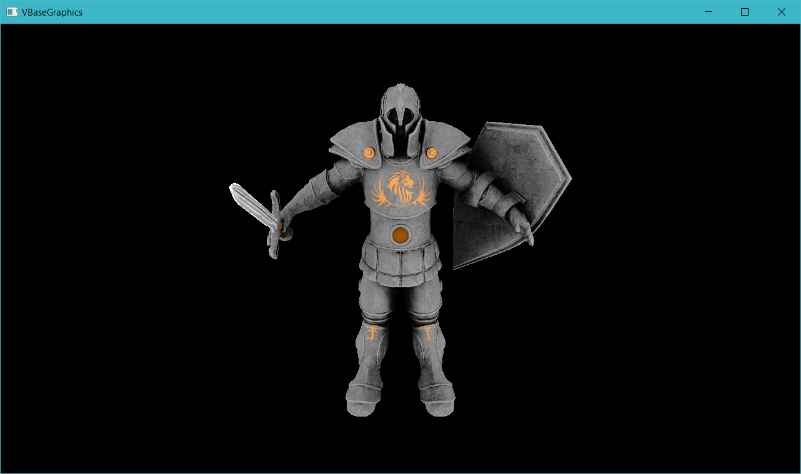
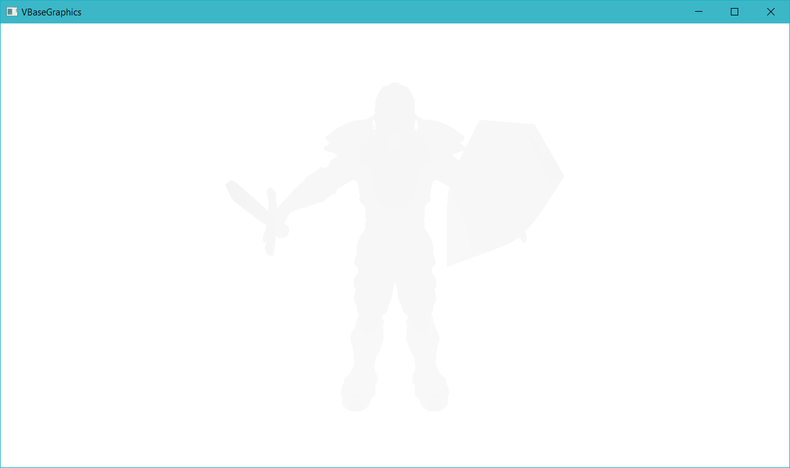
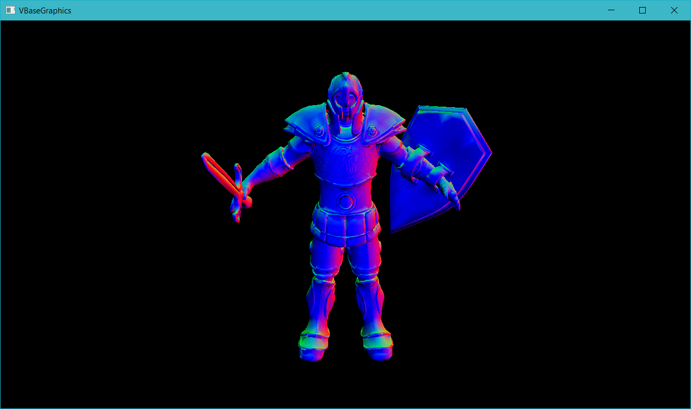
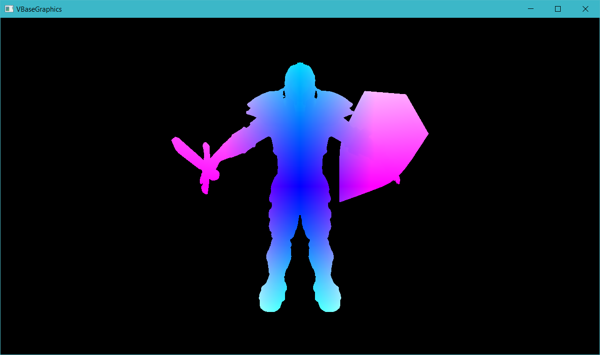

# laugh_engine

A Vulkan implementation of real-time PBR renderer.

---

### Milestone 2 - 11/28/2016

Finished:
* Basic deferred shading pipeline
* Blinn-Phong
* Point light
* Camera control
* Debug views
* Code refactorization

| Albedo | Depth |
| --- | --- |
|  |  |

| Eye Space Normal | Eye Space Position |
| --- | --- |
|  |  |

### Milestone 1 - 11/21/2016

* Finished the Vulkan tutorial by Alexander Overvoorde
* Reading and exploring Sascha Willems's Vulkan C++ examples

---

### Third-Party Credits

#### References:
* [Vulkan Tutorial by Alexander Overvoorde](https://vulkan-tutorial.com)
* [Vulkan Samples by Sascha Willems](https://github.com/SaschaWillems/Vulkan)

#### Libraries
* [GLFW](http://www.glfw.org/)
* [GLM](http://glm.g-truc.net/0.9.8/index.html)
* [stb_image](https://github.com/nothings/stb)
* [tinyobjloader](https://github.com/syoyo/tinyobjloader)

#### Assets
* [Chalet Hippolyte Chassande Baroz by Gaël](https://skfb.ly/HDVU)
* [Cerberus by Andrew Maximov](http://artisaverb.info/Cerberus.html)
