# Laugh Engine

A Vulkan implementation of real-time PBR renderer.

---

### Results

* Video demo available on [my homepage](http://jian-ru.github.io/)

| Paper Mill | Factory |
| --- | --- |
|  | 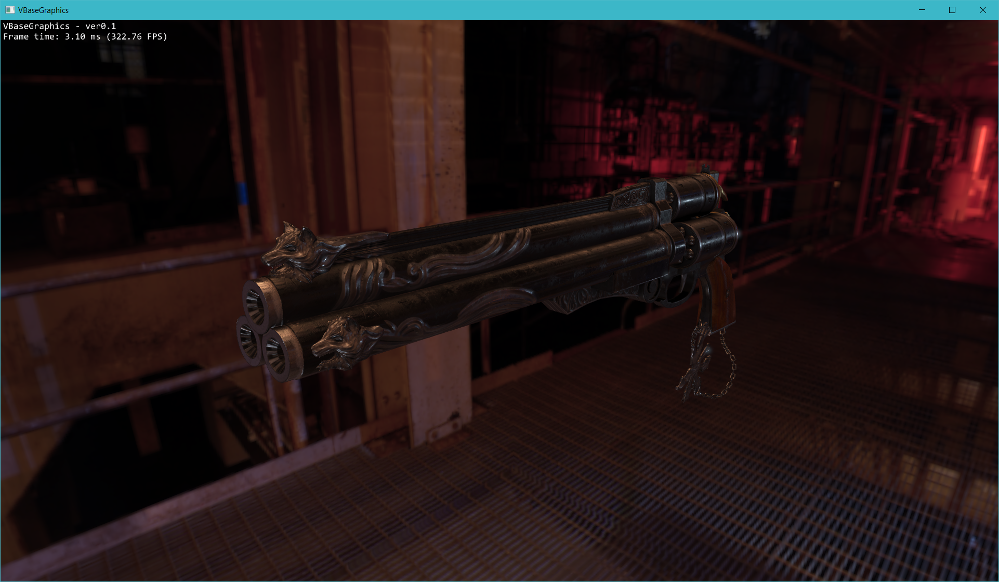 |

| Mon Valley | Canyon |
| --- | --- |
| 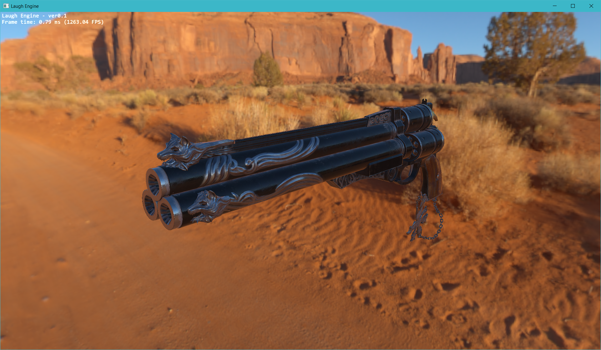 | 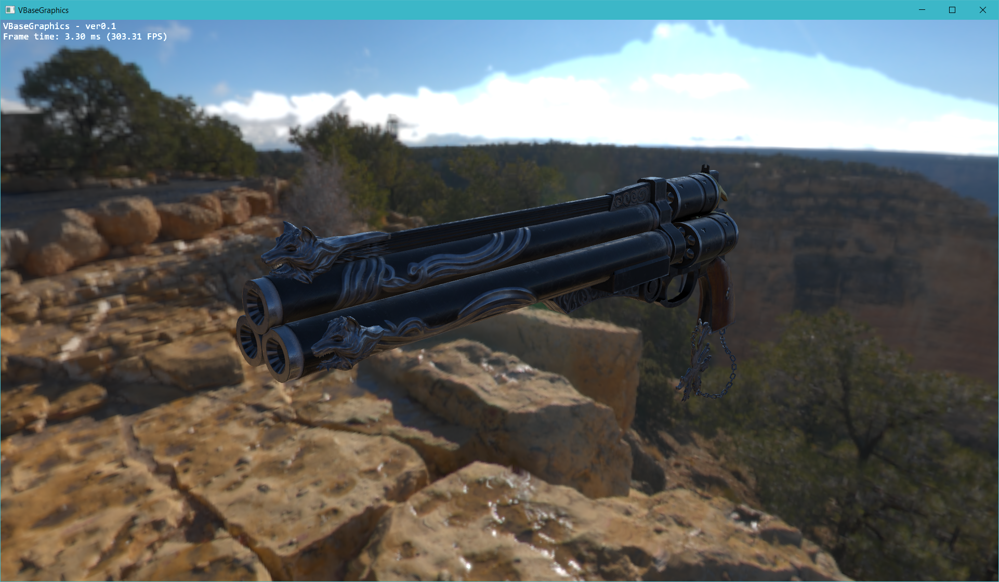 |

### Overview

| 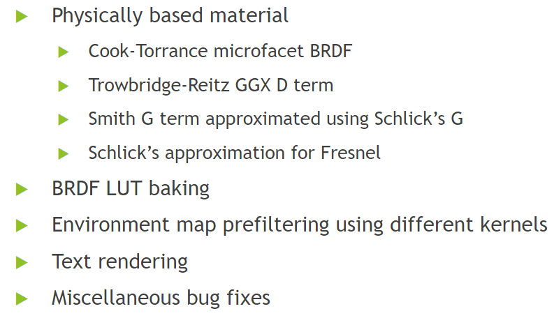 | 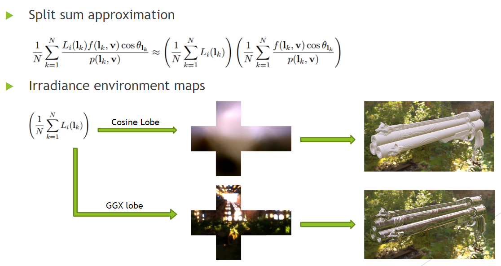 |
| --- | --- |
| 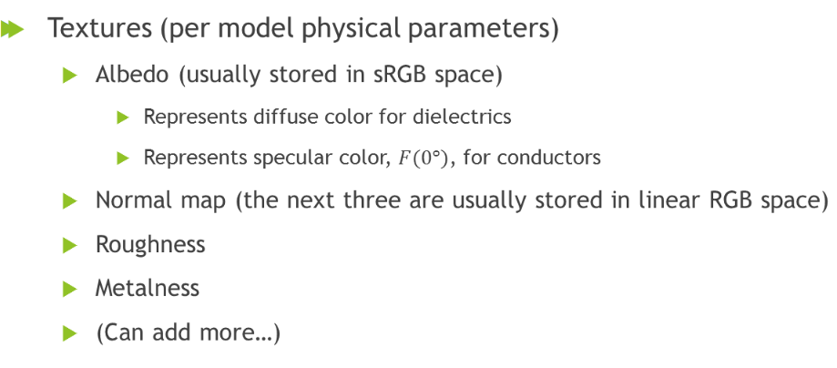 | 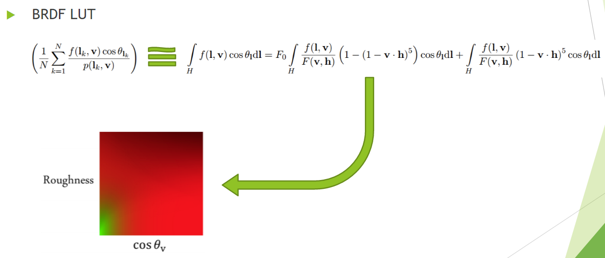 |
| 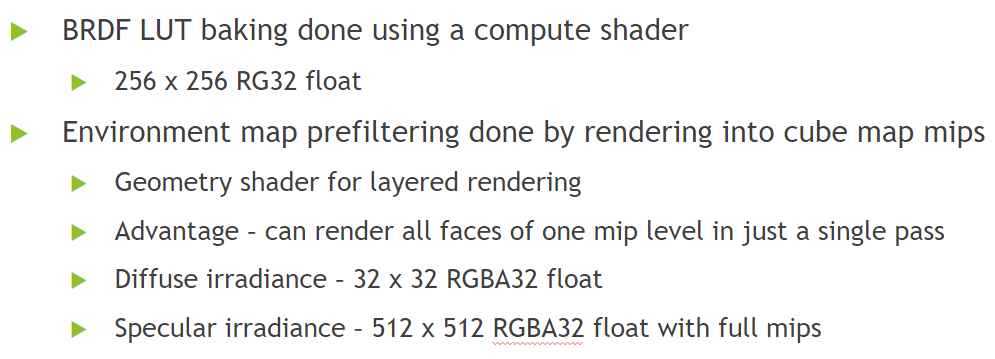 |

### Performance Analysis

* Precomputation performance
  * It is not real-time but fast enough to be used for interactive editting
  * The increase of execution time from 128x128 to 256x256 is very small. Probably the GPU is not saturated at that time.
  
  | Envrionment Prefiltering | BRDF LUT Baking |
  | --- | --- |
  | 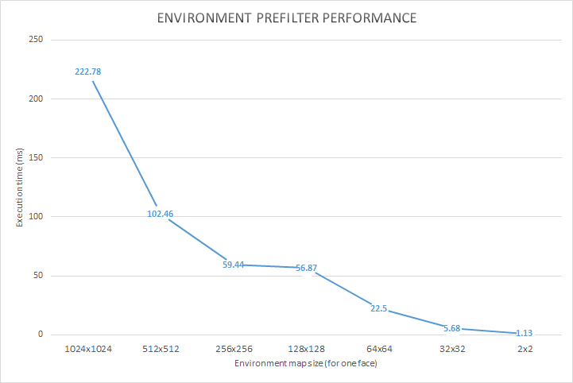 | 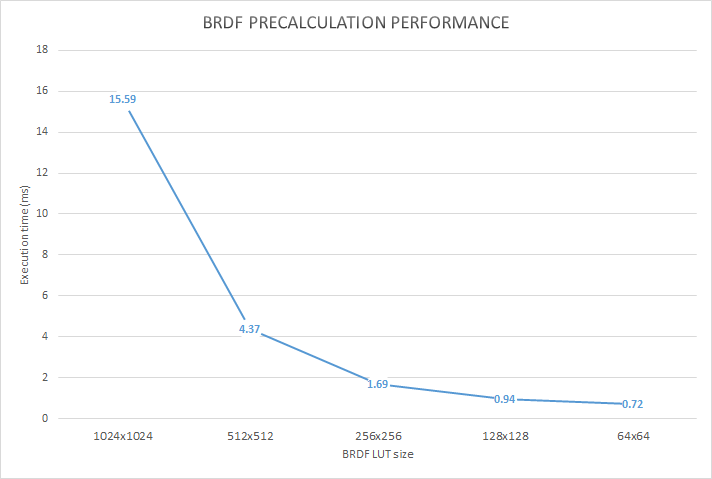 |

* PBR vs. Blinn-Phong
  * PBR using IBL only
  * Blinn-Phong was tested using two point light sources
  * Framebuffer resolution was 1920x1080 with no AA
  * Bloom was on
  * The scene with a Cerberus pistol in it was used for benchmark
  * Basically no addtional cost by using PBR over Blinn-Phong but we get much better quality
  
  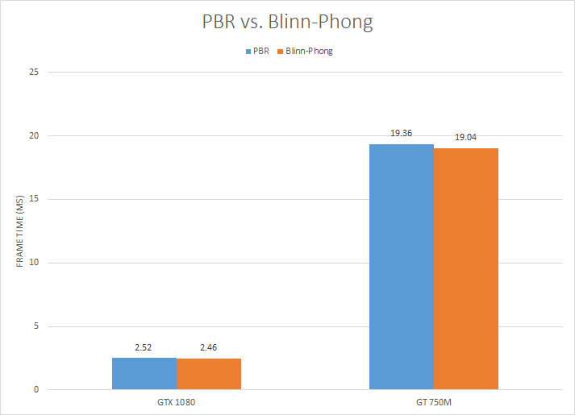

### Build Instruction

* Install LunarG Vulkan SDK
* If you have Visual Studio 2015, the solution should build out of the box
* To run the program, you will need to copy the .dlls to executable path or system paths
* Builds on other platforms are not supported yet

---

### Third-Party Credits

#### References:
* [Vulkan Tutorial by Alexander Overvoorde](https://vulkan-tutorial.com)
* [Vulkan Samples by Sascha Willems](https://github.com/SaschaWillems/Vulkan)
* [PBR Course Note](http://blog.selfshadow.com/publications/s2013-shading-course/karis/s2013_pbs_epic_notes_v2.pdf)
* [IBLBaker](https://github.com/derkreature/IBLBaker)

#### Libraries
* [GLFW](http://www.glfw.org/)
* [GLM](http://glm.g-truc.net/0.9.8/index.html)
* [GLI](http://gli.g-truc.net/0.8.2/index.html)
* [Assimp](http://www.assimp.org/)

#### Assets
* [Chalet Hippolyte Chassande Baroz by Gaël](https://skfb.ly/HDVU)
* [Cerberus by Andrew Maximov](http://artisaverb.info/Cerberus.html)
